# 🎓 Student Performance Analytics and Prediction System

<div align="center">

    

**An end-to-end Data Analytics & Machine Learning web application that predicts whether a student is a _High Performer_ or _Normal Performer_ — using only demographic features.**

[🚀 Quick Start](#-quick-start) · [📊 Results](#-key-results) · [🧠 Models](#-machine-learning-models) · [📡 API](#-api-endpoints) · [📁 Structure](#-project-structure)

</div>

---

## 📑 Table of Contents

- [🎯 Problem Statement](#-problem-statement)
- [🚀 Objectives](#-objectives)
- [📊 Dataset](#-dataset)
- [🛠️ Technology Stack](#-technology-stack)
- [📁 Project Structure](#-project-structure)
- [🚀 Quick Start](#-quick-start)
- [🧹 Pipeline Explained](#-pipeline-explained)
- [🧠 Machine Learning Models](#-machine-learning-models)
- [📈 Key Results](#-key-results)
- [🔍 Key Analytical Findings](#-key-analytical-findings)
- [📡 API Endpoints](#-api-endpoints)
- [🖥️ Web Interface](#-web-interface)
- [🎨 Visualizations](#-visualizations)
- [⚠️ Leakage Prevention](#%EF%B8%8F-leakage-prevention-why-it-matters)
- [🚧 Limitations](#-limitations)
- [🚀 Future Scope](#-future-scope)
- [🤝 Contributing](#-contributing)
- [📄 License](#-license)

---

## 🎯 Problem Statement

Each student must independently select a real-world domain and develop a **Data Analytics and Visualization-based web application** on a dataset of at least **1,000 records**.

This project delivers:

| Requirement | Status |
|:---|:---:|
| 📊 Dataset with 1,000+ real records | ✅ 1,000 records |
| 🧹 Data preprocessing & wrangling | ✅ |
| 🔍 Exploratory Data Analysis | ✅ |
| 🎨 Meaningful visualizations | ✅ 16 figures |
| 🤖 At least 2 ML models, compared | ✅ 2 models |
| 🌐 User-friendly web interface | ✅ FastAPI + Streamlit |

---

## 🚀 Objectives

1. 📥 Download and analyse a real-world student performance dataset
2. 🧹 Perform data preprocessing, cleaning, and feature engineering
3. 🔍 Conduct EDA with meaningful, publication-quality visualizations
4. 🤖 Implement and compare **Logistic Regression** vs **Random Forest**
5. ⚡ Expose analytics and predictions through a **FastAPI** backend
6. 🎛️ Build an interactive **Streamlit** frontend for visualisation and prediction
7. 🚫 Prevent data leakage by excluding exam scores from input features

---

## 📊 Dataset

| Field | Value |
|:--|:--|
| **Name** | Students Performance in Exams |
| **Source** | [Kaggle — spscientist/students-performance-in-exams](https://www.kaggle.com/datasets/spscientist/students-performance-in-exams) |
| **Records** | 1,000 |
| **Raw columns** | 8 |
| **Engineered columns** | 10 |
| **Downloaded via** | KaggleHub |

### 🧾 Features

| # | Column | Type | Description |
|:--|:--|:--:|:--|
| 1 | `gender` | Categorical | Student gender |
| 2 | `race_ethnicity` | Categorical | Race/ethnicity group |
| 3 | `parental_education` | Categorical | Highest education of parents |
| 4 | `lunch` | Categorical | `standard` or `free/reduced` |
| 5 | `test_preparation` | Categorical | Attended test prep course or not |
| 6 | `math_score` | Numerical | Math exam score (0–100) |
| 7 | `reading_score` | Numerical | Reading exam score (0–100) |
| 8 | `writing_score` | Numerical | Writing exam score (0–100) |

### ⚙️ Engineered Features

| Column | Formula |
|:--|:--|
| `average_score` | `(math_score + reading_score + writing_score) / 3` |
| `performance` | `High Performer` if `average_score >= 70`, else `Normal Performer` |

### 🎯 Target Variable

**`performance`** — binary classification

```
average_score >= 70  ──►  🏆 High Performer
average_score <  70  ──►  📗 Normal Performer
```

> ℹ️ **Note:** The exam scores (`math_score`, `reading_score`, `writing_score`, `average_score`) are used **only** to build the target label. They are **never** fed to the model — see [Leakage Prevention](#️-leakage-prevention-why-it-matters).

---

## 🛠️ Technology Stack

| Layer | Technology |
|:--|:--|
| 🐍 Language | Python 3.11+ |
| 🔢 Data | Pandas, NumPy |
| 📈 Visualisation | Matplotlib, Seaborn, Plotly |
| 🤖 ML | Scikit-learn, Joblib |
| ⚡ Backend | FastAPI, Uvicorn, Pydantic |
| 🎛️ Frontend | Streamlit, Requests |
| 📥 Data Fetch | KaggleHub |

---

## 📁 Project Structure

```
student-performance-mini-project/
├── 📂 data/
│   ├── 📂 raw/
│   │   └── 🗒️ StudentsPerformance.csv          # Original Kaggle dataset
│   └── 📂 processed/
│       └── 🗒️ processed_data.csv               # Cleaned + engineered dataset
│
├── 📂 models/
│   ├── 🤖 logistic_regression.pkl               # Trained LR pipeline
│   ├── 🌲 random_forest.pkl                     # Trained RF pipeline
│   ├── 🔧 preprocessor.pkl                      # Fitted OneHotEncoder
│   └── 📊 metrics.json                          # Evaluation metrics
│
├── 📂 reports/
│   ├── 📂 figures/                              # 16 PNG visualizations
│   └── 🗒️ *.csv                                 # Report tables (table1–table9)
│
├── 📂 backend/
│   ├── ⚡ main.py                               # FastAPI application
│   └── 🧩 schemas.py                           # Pydantic schemas
│
├── 📂 frontend/
│   └── 🎛️ app.py                               # Streamlit application
│
├── 🗒️ download_data.py                          # Step 1 — fetch dataset
├── 🗒️ preprocessing.py                          # Step 2 — clean & engineer
├── 🗒️ eda.py                                    # Step 3 — analyse & plot
├── 🗒️ train.py                                  # Step 4 — train & evaluate
├── 🗒️ requirements.txt
├── 🗒️ .gitignore
└── 📄 README.md
```

---

## 🚀 Quick Start

### 1️⃣ Prerequisites

Make sure **Python 3.11+** is installed:

```bash
python --version
```

### 2️⃣ Create a virtual environment

```bash
python -m venv venv
```

### 3️⃣ Activate the environment

<details open>
<summary><b>🪟 Windows (PowerShell / CMD)</b></summary>

```bash
venv\Scripts\activate
```

</details>

<details>
<summary><b>🐧 macOS / 🐧 Linux</b></summary>

```bash
source venv/bin/activate
```

</details>

### 4️⃣ Install dependencies

```bash
pip install -r requirements.txt
```

### 5️⃣ Run the pipeline

Run these **in order** from the project root:

```bash
# 1️⃣ Download the dataset from Kaggle
python download_data.py

# 2️⃣ Clean, validate and engineer features
python preprocessing.py

# 3️⃣ Exploratory Data Analysis + generate figures
python eda.py

# 4️⃣ Train and compare both models
python train.py
```

> ✅ The dataset, reports and trained models are **already committed** to this repository — you can skip straight to step 6 if you just want to see the app.

### 6️⃣ Start the FastAPI backend

```bash
uvicorn backend.main:app --reload
```

| | |
|:--|:--|
| 🌐 Base URL | http://127.0.0.1:8000 |
| 📖 Swagger UI | http://127.0.0.1:8000/docs |
| 📚 ReDoc | http://127.0.0.1:8000/redoc |

### 7️⃣ Start the Streamlit frontend

In a **new terminal**:

```bash
streamlit run frontend/app.py
```

🎉 App available at **http://localhost:8501**

> ⚠️ The Streamlit app calls the FastAPI backend at `http://127.0.0.1:8000`, so **the backend must be running first**.

---

## 🧹 Pipeline Explained

### 1️⃣ Download — `download_data.py`

- 📥 Pulls the dataset via KaggleHub
- 💾 Stores it at `data/raw/StudentsPerformance.csv`

### 2️⃣ Preprocess — `preprocessing.py`

- 🔍 Inspects shape, dtypes, missing values and duplicates
- 🧼 Normalises column names (`race/ethnicity` → `race_ethnicity`)
- 🗑️ Drops duplicates and missing rows
- ⚙️ Engineers `average_score` and `performance`
- 💾 Saves to `data/processed/processed_data.csv`

### 3️⃣ Analyse — `eda.py`

- 📊 Descriptive statistics
- 📈 Score distribution histograms
- 📉 Group-wise average comparisons
- 🔥 Correlation heatmap
- 💾 Saves 16 figures to `reports/figures/` and tables to `reports/`

### 4️⃣ Train — `train.py`

- ✂️ Stratified 80/20 train-test split (`random_state=42`)
- 🔧 `ColumnTransformer` + `OneHotEncoder(handle_unknown='ignore')`
- 🤖 Trains Logistic Regression and Random Forest
- 📊 Accuracy, Precision, Recall, F1-Score, ROC-AUC
- 💾 Persists pipelines with Joblib + writes `metrics.json`

---

## 🧠 Machine Learning Models

| Parameter | Value |
|:--|:--|
| ✂️ Train/Test split | 80% / 20% (stratified) |
| 🎲 Random seed | `42` |
| 🔤 Encoding | One-Hot Encoding (`handle_unknown='ignore'`) |
| 📥 Input features | `gender`, `race_ethnicity`, `parental_education`, `lunch`, `test_preparation` |
| 🏆 Selection criterion | Highest **F1-score** |

### 📊 Model Comparison

| Model | Accuracy | Precision | Recall | F1-Score | ROC-AUC |
|:--|--:|--:|--:|--:|--:|
| 📈 **Logistic Regression** | **0.6850** | **0.6706** | **0.6196** | **0.6441** | **0.7652** |
| 🌲 Random Forest | 0.5800 | 0.5417 | 0.5652 | 0.5532 | 0.6312 |

### 🏆 Best Model: **Logistic Regression** (F1 = 0.6441)

> 💡 **Why did Logistic Regression win?** With only five low-cardinality categorical features and 800 training rows, the dataset sits in a **low-complexity, near-linear regime**. Random Forest's 100 deep trees overfit this small sample, whereas a regularised linear model generalises better — visible in both F1-score and ROC-AUC.

### 🔍 Feature Importance (Random Forest)

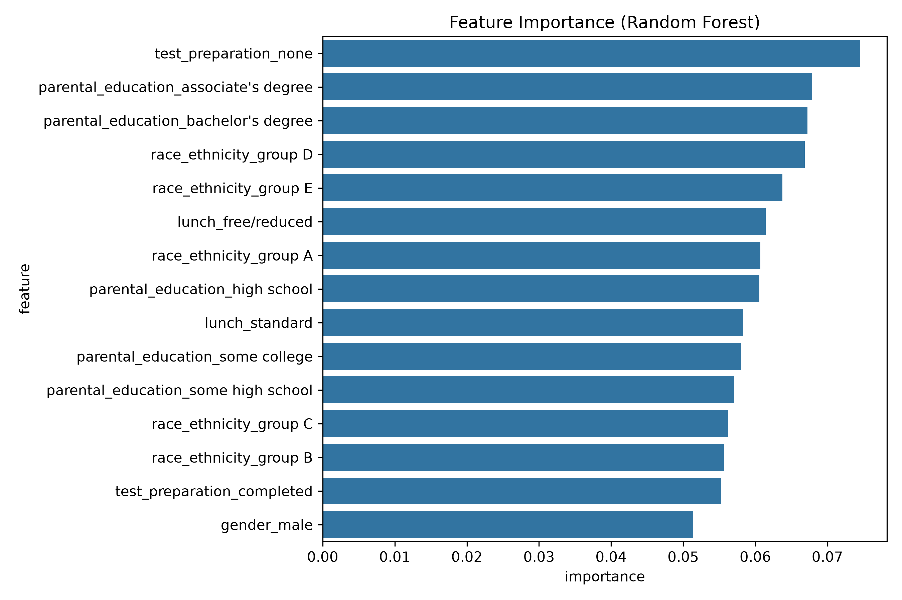

---

## 📈 Key Results

| Metric | Value |
|:--|--:|
| 👥 Total students | 1,000 |
| 🏆 High Performers | 459 (45.9%) |
| 📗 Normal Performers | 541 (54.1%) |
| 📐 Overall average score | 67.77 |
| 📐 Average math score | 66.09 |
| 📐 Average reading score | 69.17 |
| 📐 Average writing score | 68.05 |

### 🧾 Model Evaluation Artefacts

| Artefact | Description |
|:--|:--|
| 📊 [table9_model_comparison.csv](reports/table9_model_comparison.csv) | Side-by-side metrics |
| 🖼️ [model_comparison.png](reports/figures/model_comparison.png) | Grouped bar chart |
| 🖼️ [roc_curve.png](reports/figures/roc_curve.png) | ROC curves for both models |
| 🖼️ [confusion_matrix_lr.png](reports/figures/confusion_matrix_lr.png) | LR confusion matrix |
| 🖼️ [confusion_matrix_rf.png](reports/figures/confusion_matrix_rf.png) | RF confusion matrix |

---

## 🔍 Key Analytical Findings

### 🍽️ Lunch Status — the strongest signal

| Lunch | Average Score | Δ |
|:--|--:|--:|
| 🍱 `standard` | **70.84** | — |
| 🥗 `free/reduced` | 62.20 | **−8.64** |

Students on the standard lunch programme outperform those receiving free/reduced lunch by **8.6 points**, by far the largest group gap in the dataset.

### 📝 Test Preparation Course

| Preparation | Average Score | Δ |
|:--|--:|--:|
| ✅ `completed` | **72.67** | — |
| ❌ `none` | 65.04 | **+7.63** |

Completing test preparation raises the average score by **7.6 points**.

### 👤 Gender

| Gender | Average Score | Δ |
|:--|--:|--:|
| 👩 `female` | **69.57** | — |
| 👨 `male` | 65.84 | **+3.73** |

Females score **3.7 points** higher on average across the three subjects.

### 🧠 Full Group Analysis

| Category | Average Score |
|:--|:--|
| ⚖️ Gender | [table4_gender_avg.csv](reports/table4_gender_avg.csv) |
| 🌍 Race / Ethnicity | [table5_race_avg.csv](reports/table5_race_avg.csv) |
| 🎓 Parental Education | [table6_parental_avg.csv](reports/table6_parental_avg.csv) |
| 🍱 Lunch | [table7_lunch_avg.csv](reports/table7_lunch_avg.csv) |
| 📝 Test Preparation | [table8_testprep_avg.csv](reports/table8_testprep_avg.csv) |

---

## 📡 API Endpoints

Base URL: `http://127.0.0.1:8000`

| Method | Endpoint | Description |
|:--:|:--|:--|
| `GET` | `/` | 🏷️ API info and status |
| `GET` | `/api/health` | 💚 Health check |
| `GET` | `/api/analytics` | 📊 Dataset analytics, score averages, group breakdowns |
| `GET` | `/api/models` | 🤖 Model metrics and comparison |
| `POST` | `/api/predict` | 🎯 Predict student performance |

### 🎯 Example — `POST /api/predict`

**Request body**

```json
{
  "gender": "female",
  "race_ethnicity": "Group C",
  "parental_education": "bachelor's degree",
  "lunch": "standard",
  "test_preparation": "completed"
}
```

**Response**

```json
{
  "prediction": "High Performer",
  "probability": 0.8213,
  "model": "Logistic Regression"
}
```

> 🔍 Full interactive documentation with try-it-out buttons: **http://127.0.0.1:8000/docs**

---

## 🖥️ Web Interface

The Streamlit app provides **six** sections:

| # | Page | Highlights |
|:--:|:--|:--|
| 1️⃣ | 📊 **Dashboard** | Key metrics, performance & score distributions |
| 2️⃣ | 🗃️ **Data & Preprocessing** | Dataset overview, sample records, descriptive stats |
| 3️⃣ | 🔍 **EDA & Visualizations** | Distributions, group comparisons, correlation heatmap |
| 4️⃣ | 🤖 **Machine Learning** | Metrics table, comparison chart, methodology, metric definitions |
| 5️⃣ | 🎯 **Prediction** | Interactive form with confidence gauge and probability bars |
| 6️⃣ | ℹ️ **About** | Problem statement, stack, architecture, limitations |

> ⚠️ The **Prediction** page requires the FastAPI backend to be live.

---

## 🎨 Visualizations

All 16 figures are committed under [`reports/figures/`](reports/figures).

### 📊 Distributions

| Math Score | Reading Score | Writing Score |
|:-:|:-:|:-:|
| 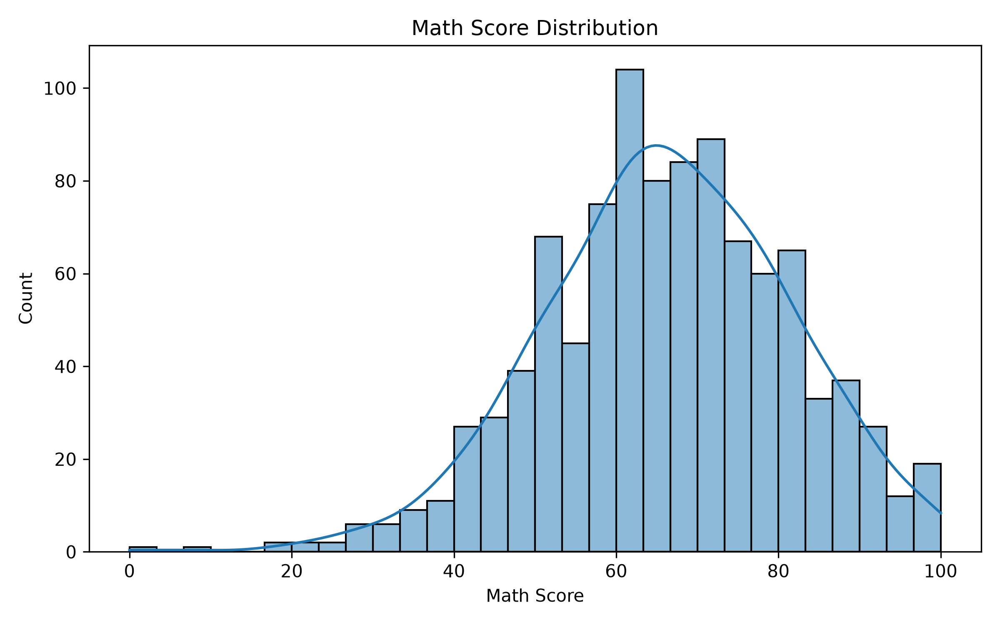 | 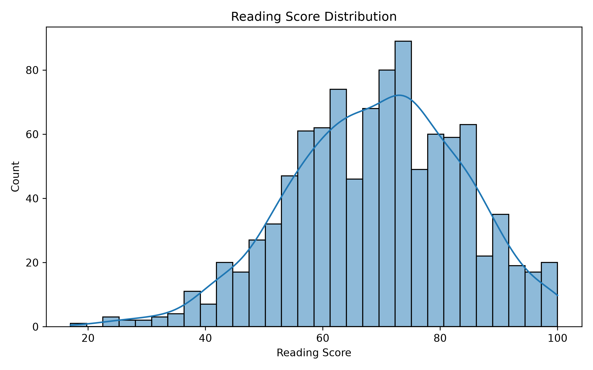 | 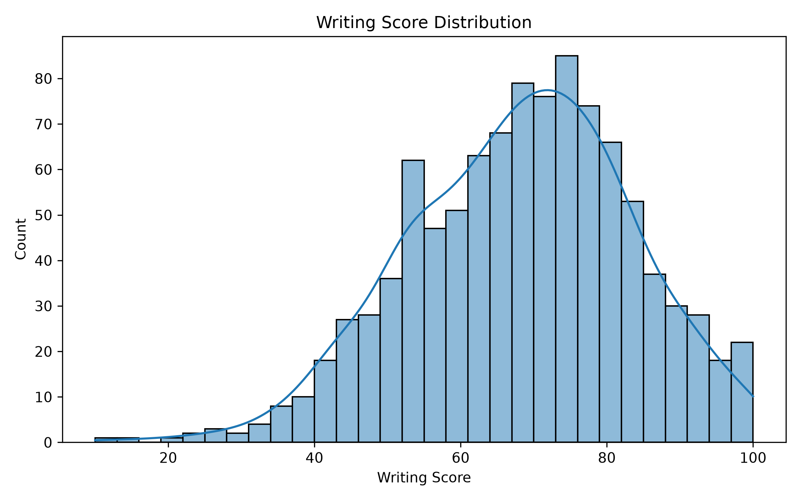 |

### 📈 Overall & Target Distribution

| Average Score Distribution | Performance Distribution |
|:-:|:-:|
| 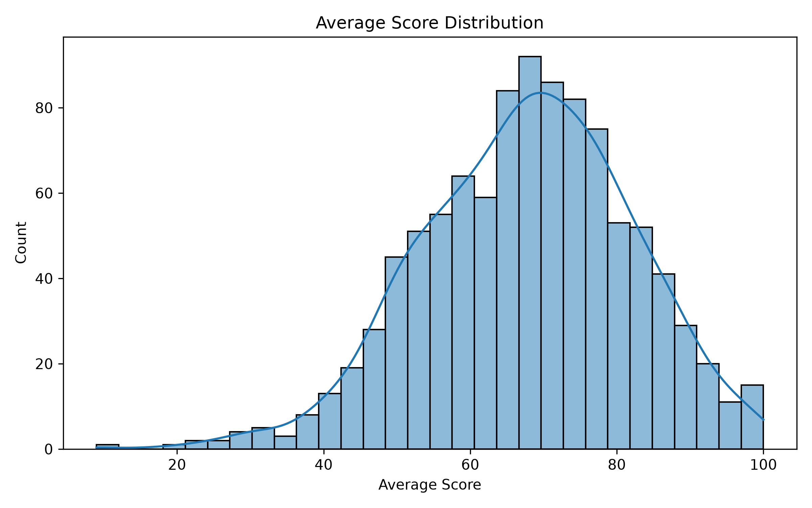 | 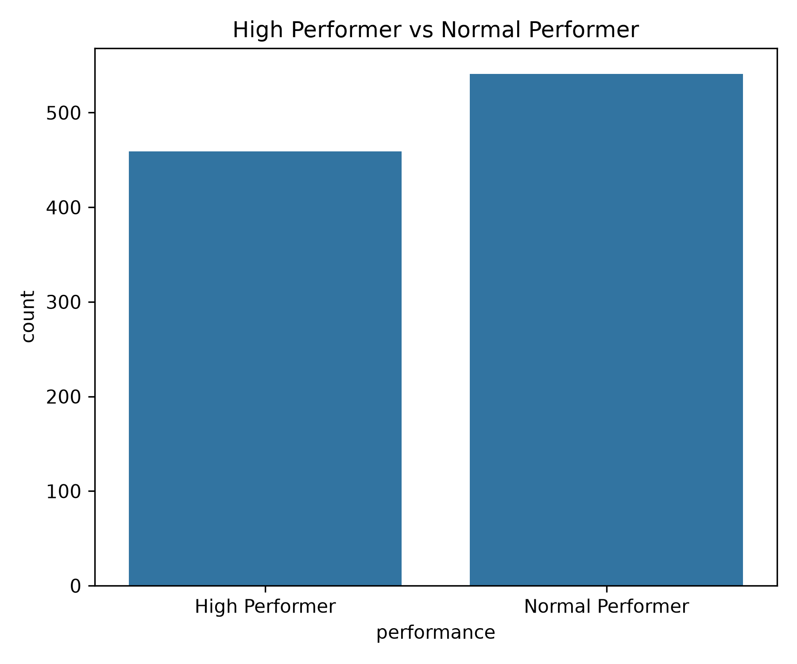 |

### ⚖️ Group Comparisons

| Gender | Lunch |
|:-:|:-:|
| 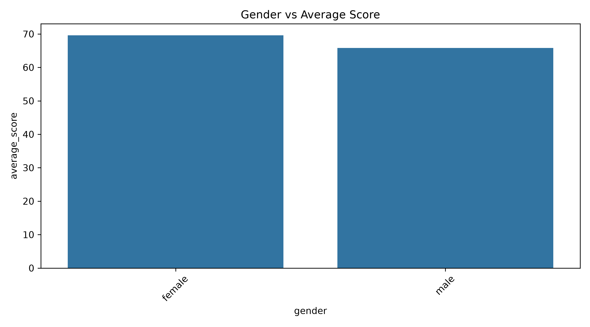 | 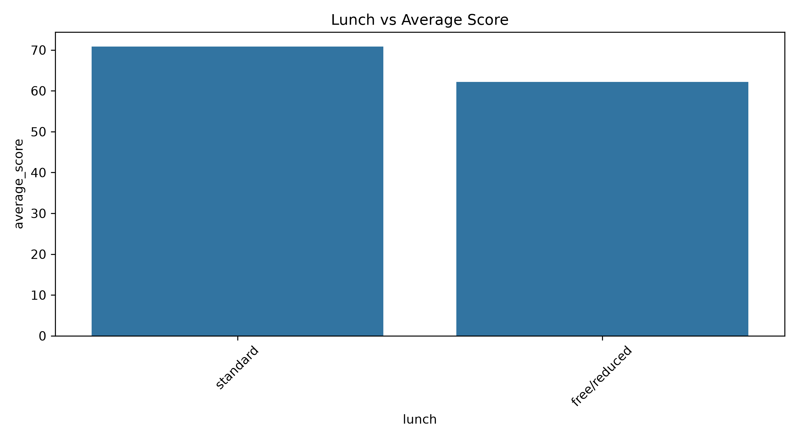 |

| Race / Ethnicity | Parental Education |
|:-:|:-:|
| 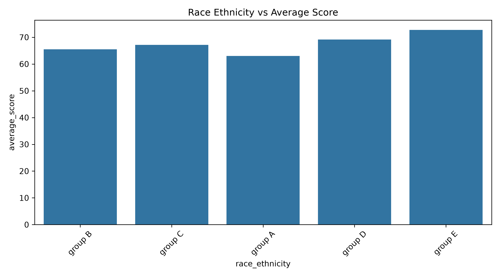 | 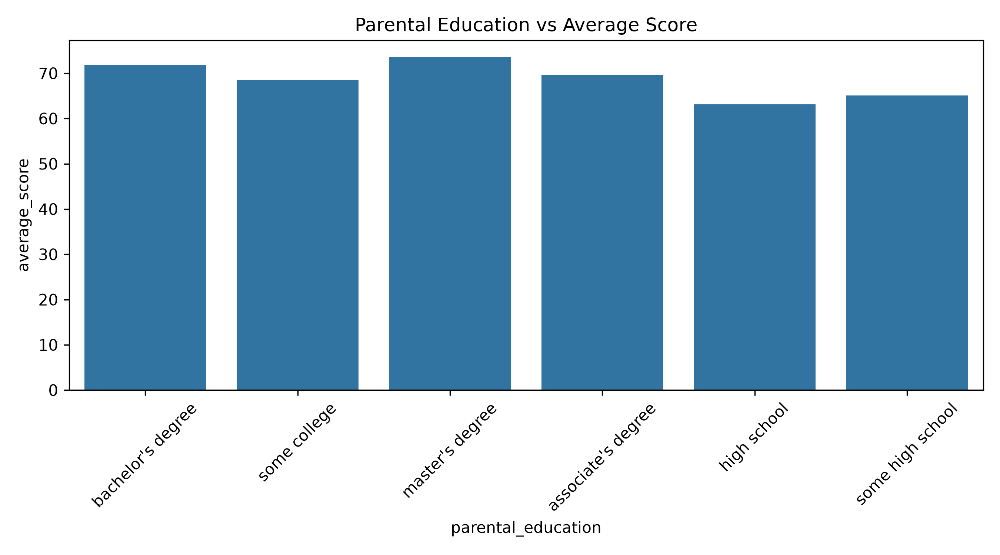 |

### 📝 Test Preparation

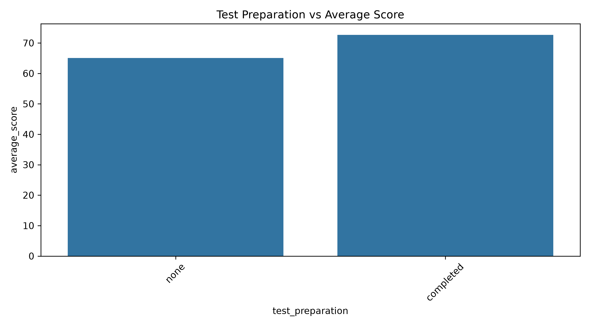

### 🔥 Correlation Heatmap

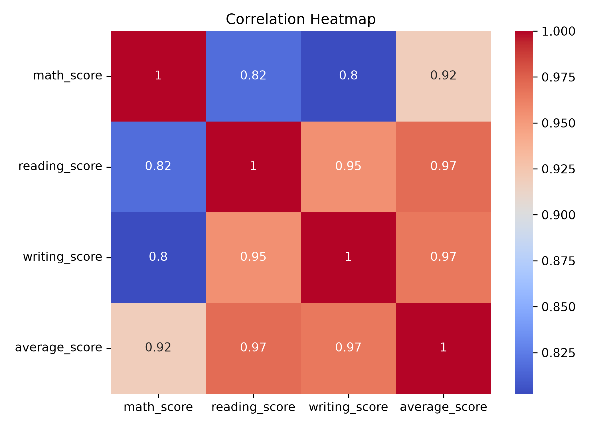

---

## ⚠️ Leakage Prevention: Why It Matters

A common mistake in student-performance projects is to predict a label derived from exam scores **while also feeding those exam scores to the model**. That inflates accuracy to a meaningless ~99.9% and the model learns nothing useful.

This project deliberately builds the target from exam scores but predicts using **only five demographic features**:

| ✅ Used as input | 🚫 Excluded from input |
|:--|:--|
| `gender` | `math_score` |
| `race_ethnicity` | `reading_score` |
| `parental_education` | `writing_score` |
| `lunch` | `average_score` |
| `test_preparation` | — |

> 📉 **The honest consequence:** F1 = 0.644 rather than a fake ~1.0. Demographics alone carry genuine but limited signal — which is exactly what makes the result credible.

---

## 🚧 Limitations

- ⚠️ Binary classification with a fixed threshold of 70
- ⚠️ Only five low-cardinality categorical input features
- ⚠️ Small dataset of 1,000 records (200 test rows)
- ⚠️ Random Forest overfits at this sample size
- ⚠️ Predictions indicate **association, not causation**
- ⚠️ Predictions do not guarantee real academic performance
- ⚠️ Dataset is a Kaggle sample and not representative of all students

---

## 🚀 Future Scope

- 🤖 Try additional algorithms — XGBoost, LightGBM, SVM, KNN
- 🔧 Hyperparameter tuning with GridSearchCV / RandomizedSearchCV
- 📥 Add more features — attendance, study hours, prior GPA, extracurriculars
- 🧠 Explainable AI with SHAP values
- 📊 Multi-class classification instead of a binary threshold
- ☁️ Containerise with Docker and deploy to the cloud
- 🗄️ Move storage to a database instead of CSV
- 📈 Add time-series tracking of student progress

---

## 🤝 Contributing

Contributions are welcome! 🎉

1. 🍴 Fork the repository
2. 🌿 Create a feature branch: `git checkout -b feature/your-feature`
3. ✍️ Commit your changes
4. 🚀 Push and open a Pull Request

---

## 📄 License

Released under the [MIT License](LICENSE).

---

<div align="center">

### ⭐ Star this repository if it helped you!

Made with ❤️ using Python, FastAPI, Streamlit and a lot of ☕

**[⬆ Back to Top](#-student-performance-analytics-and-prediction-system)**

</div>
